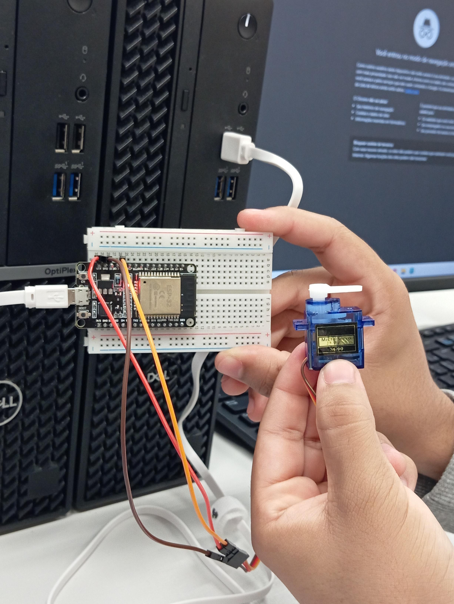

# Controle de Servo Motor SG90 com ESP32 (Guia Rápido)

Este README mostra, de forma direta e com fotos, como montar e programar um **servo SG90** usando a **ESP32** e a biblioteca **ESP32Servo**.

---

## 1) Visão geral do resultado (montagem completa)
.jpg)

- **ESP32** conectada via USB ao PC.
- **Servo SG90** alimentado em **5V** e **GND**; fio de **sinal** no **GPIO 14**.
- Protoboard apenas para organizar as conexões.

> Dica: para **1 servo SG90**, normalmente o 5V do USB da ESP32 dá conta. Se o servo tremer muito, esquentar ou a ESP32 **reiniciar**, use **fonte 5V externa** (>=1A) e **aterramento comum** (GND da fonte ligado ao GND da ESP32).

---

## 2) Detalhe das ligações na ESP32
.jpg)

- **Laranja** = **SINAL** → **GPIO 14** (qualquer pino PWM serve; veja a lista abaixo).
- **Vermelho** = **5V** → pino **5V/VIN** da ESP32 **ou** 5V de fonte externa.
- **Marrom** = **GND** → **GND** da ESP32 (e da fonte, se usar).

**Pinos PWM recomendados na ESP32**: 12–19, 21–23, 25–27, 32–33.  
No exemplo usamos **GPIO 14**.

---

## 3) Identificando os fios do servo SG90
.jpg)

- **Vermelho** → **VCC (5V)**
- **Marrom** → **GND**
- **Laranja** → **SINAL (PWM)**

> Não alimente o servo em **3.3V** (risco de travar/resetar a placa).

---

## 4) ESP32 na protoboard


- Encaixe a ESP32 **centralizada** para liberar pinos dos dois lados.
- Use os **rails** (linhas vermelha/azul) da protoboard para distribuir 5V e GND.
- Se usar **fonte externa**, coloque um **capacitor eletrolítico 470–1000µF/10V** entre 5V e GND próximos ao servo para reduzir quedas de tensão (observando a polaridade).

---

## 5) Preparando a IDE (Arduino IDE)

1. **Instalar o core da ESP32**:  
   *Ferramentas → Placa → Gerenciador de Placas…* → busque **“ESP32 by Espressif Systems”** e instale.
2. **Selecionar a placa e a porta**:  
   *Ferramentas → Placa → ESP32 Arduino → ESP32 Dev Module* (ou o modelo correspondente) e escolha a **Porta** correta.
3. **Instalar a biblioteca do servo**:  
   *Ferramentas → Gerenciar Bibliotecas…* → busque **“ESP32Servo”** e instale.
4. **Upload**: em alguns modelos é preciso **manter pressionado o botão `BOOT`** quando a IDE mostra *“Connecting…”*; solte após começar a gravação (*“Writing at …”*). Se necessário, pressione **EN/RESET** ao final.

---

## 6) Código de exemplo

```cpp
#include <ESP32Servo.h>
 
Servo servo;
 
void setup() {
  // Configuração do servo motor
  servo.attach(14); // A linha do pino pode ser ajustada conforme a sua conexão no ESP32
}
 
void loop() {
  // Movimentação do servo motor
  servo.write(0);
  delay(1000);
 
  servo.write(90);
  delay(1000);
 
  servo.write(180);
  delay(1000);
 
  servo.write(90);
  delay(1000);
}
```

**Notas úteis**
- `servo.attach(pin)`: use um pino com PWM (ex.: 14).
- Ângulos usuais: **0°–180°** (alguns servos variam levemente).
- Se houver **ruído/jitter**, confira **GND comum**, qualidade dos cabos e a **fonte 5V**.

---

## 7) Checklist rápido (para funcionar de primeira)
- [ ] Biblioteca **ESP32Servo** instalada.
- [ ] Placa **ESP32** configurada na IDE e **porta** correta selecionada.
- [ ] **Sinal no GPIO 14**, **5V** no fio **vermelho**, **GND** no **marrom**.
- [ ] Se pedir, **pressionar `BOOT`** durante o upload.
- [ ] Com fonte externa: **GND comum** entre fonte e ESP32.
- [ ] (Opcional) **Capacitor 470–1000µF** próximo ao servo para evitar resets.

---

Pronto! O servo irá alternar entre **0°, 90° e 180°** continuamente.
